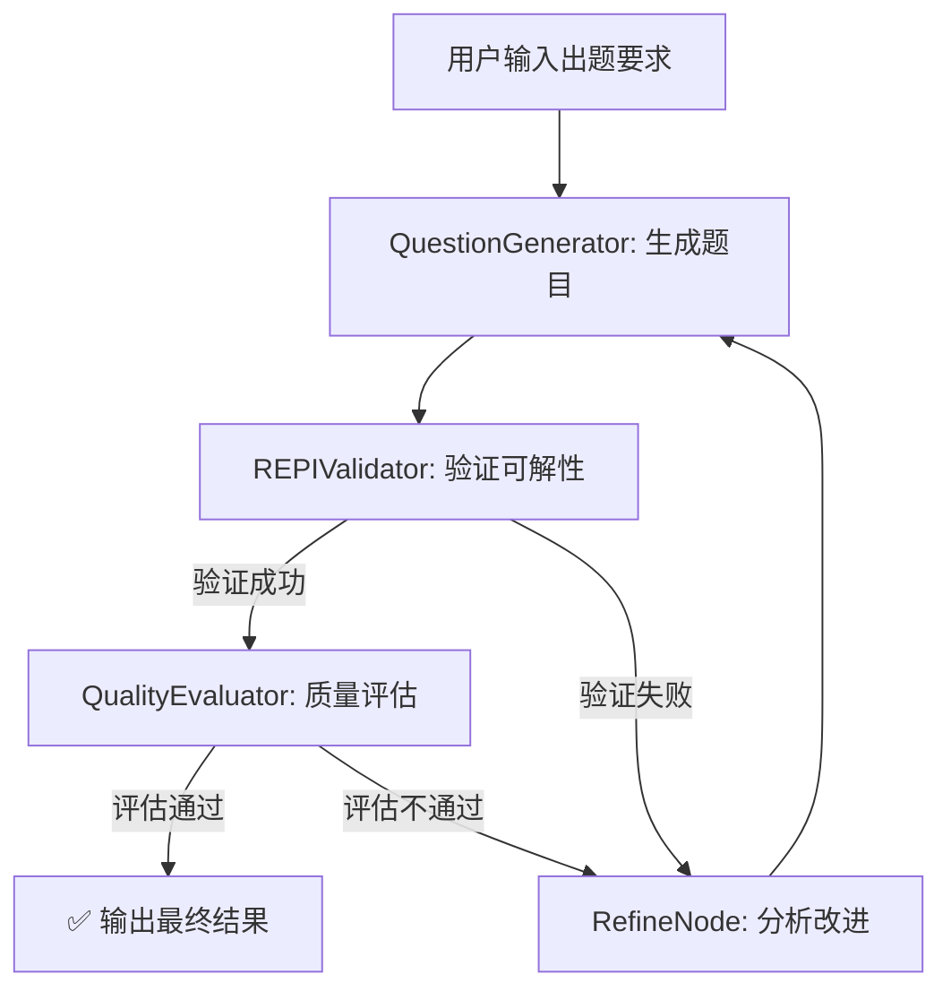

# QuestionGeneration - AI数学题目生成系统

## 📌 模块简介

QuestionGeneration是一个完整的AI数学题目自动生成系统，通过"生成→验证→评估→改进"的闭环工作流，确保产出高质量、可解且符合要求的原创数学题目。

## ✨ 核心特性

- **🧠 闭环自优化**：从出题到验证、评估、再到改进的完整自动化闭环
- **🤖 纯AI原创模式**：利用高度优化的元提示词，引导大模型生成高质量题目
- **🔬 REPI可解性验证**：内置REPI Agent验证题目的逻辑严谨性和可解性
- **⚖️ AI驱动的质量评估**：多维度对题目进行打分和评估
- **🔧 自动化题目改进**：根据验证和评估结果自动迭代优化
- **📄 格式化输出**：生成包含题目、评估、验证摘要和LaTeX源码的完整文档

## 🏗️ 系统架构

### 核心模块

1. **QuestionGenerator（出题生成器）**
   - 使用AI大模型生成数学题目
   - 支持多种题型和难度级别
   - 输出LaTeX格式的题目和解析

2. **REPIValidator（REPI验证器）**
   - 使用ReNode（推理）和PINode（代码执行）验证题目可解性
   - 模拟真实解题过程
   - 提供详细的解题统计信息

3. **QualityEvaluator（质量评估器）**
   - 多维度评估题目质量
   - 评分标准：原创性、可解性、复杂度、知识覆盖、教学价值
   - 自动决策是否接受或改进

4. **RefineNode（改进节点）**
   - 分析失败原因
   - 生成改进建议
   - 触发重新生成

## 📊 工作流程



## 🚀 快速开始

### 基本使用

```python
from code.QuestionGeneration import create_question_generation_flow

# 创建出题工作流
flow = create_question_generation_flow()

# 配置出题参数
shared = {
    'task_scenario': '为准备高考的学生设计一道函数与导数的压轴题',
    'problem_type': '函数与导数',
    'difficulty_level': '高考压轴题',
    'topic_keywords': ['导数', '不等式', '参数讨论'],
    'requirements': '需要包含参数分类讨论'
}

# 运行工作流
flow.run(shared)

# 获取结果
final_problem = shared.get('final_formatted_output')
print(final_problem)
```

### 命令行使用

```bash
python -m code.QuestionGeneration.main
```

## 📝 输入参数说明

| 参数 | 类型 | 说明 | 示例 |
|------|------|------|------|
| task_scenario | str | 出题任务描述 | "为准备清北强基计划的高中生设计压轴题" |
| problem_type | str | 题目类型/知识领域 | "函数与导数" |
| difficulty_level | str | 难度级别和风格 | "高考压轴题" / "竞赛级" |
| topic_keywords | list | 关键词列表 | ["导数", "不等式", "构造"] |
| requirements | str | 具体要求 | "需要包含参数分类讨论" |

## 📤 输出格式

系统输出包含以下内容：

1. **题目内容**：完整的数学题目描述
2. **质量评估**：
   - 原创性与创新性评分
   - 可解性评分
   - 复杂度与区分度评分
   - 知识覆盖与融合评分
   - 教学价值评分
   - 综合评分
3. **REPI验证结果**：
   - 解题状态（成功/失败）
   - 解题步数统计
   - 推理/计算/反馈步数
4. **LaTeX源码**：可直接编译的完整LaTeX代码

## 🔧 配置说明

### 环境变量

在使用前需要配置以下环境变量：

```bash
# .env 文件
LLM_API_KEY=your_deepseek_api_key
LLM_BASE_URL=https://api.deepseek.com/v1
MODEL_NAME=deepseek-chat
MAX_RETRY=3
```

### 模型配置

默认使用兼容OpenAI接口的 DeepSeek 公共模型，可在代码中修改：

```python
# 在 generator.py 中修改
self.model = "deepseek-chat"  # 或其他支持的模型
```

## 📚 模块详解

### 1. QuestionGenerator

**职责**：生成原创数学题目

**核心方法**：
- `generate(task_scenario, temperature)`: 生成题目
- `_extract_problem_from_latex(latex_content)`: 从LaTeX中提取题目文本

**提示词策略**：
- 双核工作站模式（策略师+工匠）
- 强调数学思想深度和结构美
- 严格的LaTeX格式要求

### 2. REPIValidator

**职责**：验证题目可解性

**核心组件**：
- `ReNode`: 推理节点，进行数学推理和代码编写
- `PINode`: Python解释器节点，执行计算代码
- `AnswerNode`: 答案整理节点

**验证流程**：
1. 推理分析题目
2. 编写Python代码计算
3. 执行代码获取结果
4. 反馈结果继续推理
5. 得出最终答案

### 3. QualityEvaluator

**职责**：评估题目质量

**评估维度**：
1. **原创性与创新性** (1-10分)
2. **可解性** (1-10分)
3. **复杂度与区分度** (1-10分)
4. **知识覆盖与融合** (1-10分)
5. **教学价值** (1-10分)

**决策标准**：
- 综合评分 ≥ 7.0：接受题目
- 综合评分 < 7.0：触发改进流程

### 4. RefineNode

**职责**：分析问题并生成改进建议

**分析维度**：
- REPI解题成功率
- 解题步数合理性
- 计算成功率
- 质量评估反馈

**改进策略**：
- 简化过于复杂的题目
- 增加过于简单题目的难度
- 修正数据设置问题
- 优化题目描述

## 🎯 使用场景

1. **教育机构**：批量生成练习题、模拟考题
2. **在线教育平台**：动态生成个性化题目
3. **教师备课**：快速生成高质量教学素材
4. **竞赛培训**：生成竞赛级难度题目
5. **自主学习**：生成针对性练习题

## ⚙️ 高级配置

### 自定义评分标准

```python
# 在 evaluator.py 中修改
ACCEPT_THRESHOLD = 7.0  # 接受题目的最低分数
MAX_ITERATIONS = 15     # 最大迭代次数
```

### 自定义REPI验证参数

```python
# 在 validator.py 中修改
MAX_SOLVE_STEPS = 12    # 最大解题步数
TIMEOUT = 30            # 代码执行超时时间（秒）
```

## 📖 示例

### 示例1：生成高考压轴题

```python
shared = {
    'task_scenario': '为高考数学设计一道函数与导数的压轴题',
    'problem_type': '函数与导数',
    'difficulty_level': '高考压轴题',
    'topic_keywords': ['导数', '单调性', '极值'],
    'requirements': '需要分类讨论参数'
}
```

### 示例2：生成竞赛题

```python
shared = {
    'task_scenario': '为数学竞赛设计一道数论题',
    'problem_type': '数论',
    'difficulty_level': '国家级竞赛',
    'topic_keywords': ['同余', '不定方程'],
    'requirements': '需要巧妙构造'
}
```

## 🐛 常见问题

### Q1: 生成的题目质量不理想？
A: 尝试调整以下参数：
- 增加 `topic_keywords` 的具体性
- 在 `requirements` 中明确更多约束
- 调整 `temperature` 参数（默认0.7）

### Q2: REPI验证总是失败？
A: 可能原因：
- 题目过于复杂，超出REPI能力
- 题目描述不清晰
- 需要的数学知识超出模型范围

### Q3: 系统一直循环改进？
A: 检查：
- `MAX_RETRY` 设置是否合理
- 评分标准是否过于严格
- 模型API是否正常

## 🔄 版本历史

- **v1.0.0** (2025-01)
  - 初始版本发布
  - 支持纯AI模式出题
  - 集成REPI验证系统
  - 实现质量评估和自动改进

## 📄 许可证

本项目遵循项目根目录的许可证协议。

## 👥 贡献者

WiseStar Team - 智多星项目组

## 📧 联系方式

如有问题或建议，请通过项目Issue反馈。
