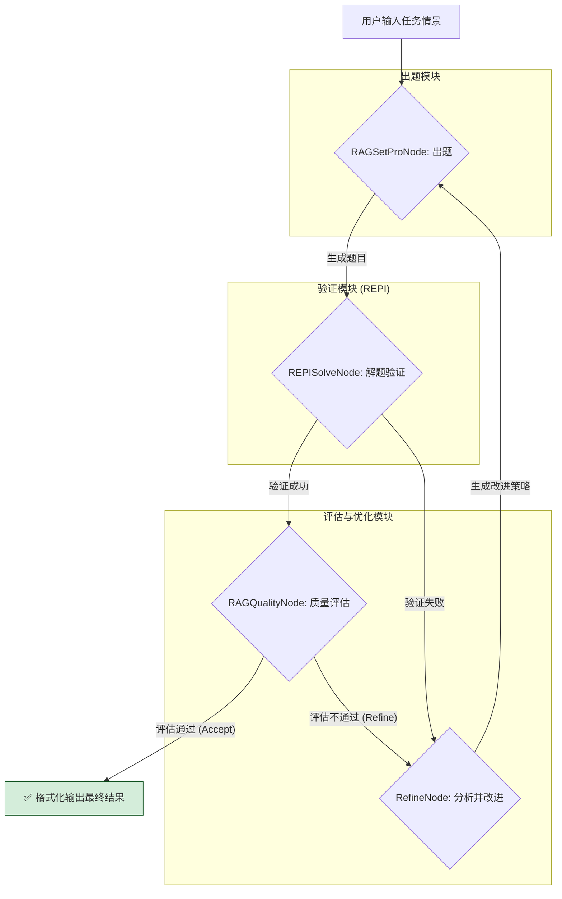
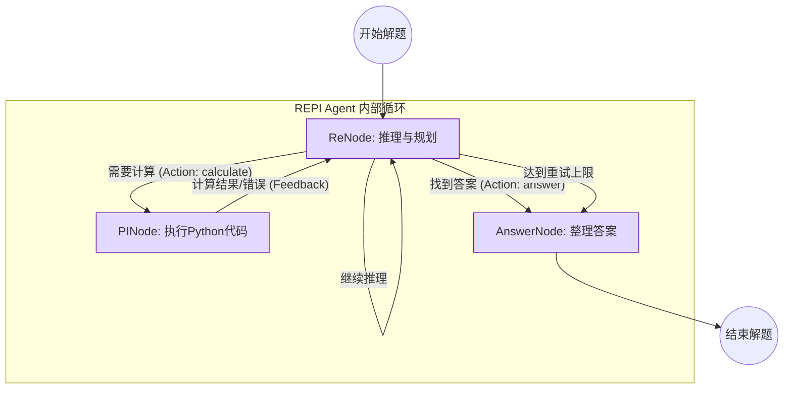

# RAG增强AI出题系统 - 集成REPI验证

这是一个先进的、自动化的AI出题系统。它不仅仅是简单地生成题目，而是构建了一个 **“生成→验证→评估→改进”** 的闭环工作流，以确保产出高质量、可解且符合要求的原创题目。

系统的核心思想是：利用**RAG（检索增强生成）**或**纯AI大模型**的强大创作能力来生成初版题目，然后立即通过一个**REPI（推理-执行-规划-迭代）** Agent对题目进行试解，以验证其**可解性**和**难度**。最后，系统会调用AI对整个过程进行**质量评估**，并根据评估结果决定是接受题目，还是启动**自动改进**流程，循环往复，直至产出符合标准的最终题目。

## 核心特性 ✨

- **🧠 闭环自优化**：实现了从出题到验证、评估、再到改进的完整自动化闭环，能够自主迭代优化题目质量。
- **📚 双模式出题引擎**：
    - **RAG增强模式**：智能检测并利用本地知识库，结合检索到的相似例题和解题思路，生成内容更丰富、有据可依的题目。
    - **纯AI原创模式**：在无RAG支持时，利用高度优化的`元提示 (Meta-Prompt)`，引导大模型扮演“数学命题宗师”，进行高质量的零样本原创。
- **🔬 REPI可解性验证**：内置一个基于`ReNode`(推理)和`PINode`(代码执行)的REPI Agent，它会像学生一样尝试解答AI生成的题目，从实践上检验题目的逻辑严谨性和可解性。
- **⚖️ AI驱动的质量评估**：在题目通过REPI验证后，系统会再次调用大模型，从多个维度（如RAG利用度、复杂度、教学价值等）对题目进行打分和评估。
- **🔧 自动化题目改进**：如果题目在验证或评估环节未达标（如：REPI无法解出、评估分数过低），系统将分析失败原因，并生成改进建议，然后返回出题环节重新生成。
- **📄 格式化输出**：最终产出包含题目、质量评估、REPI验证摘要和完整LaTeX源码的Markdown文件，方便使用和归档。

## 系统架构与工作流

本系统的核心是一个由多个功能节点组成的自主工作流。它以用户的需求为起点，通过一系列精密的节点协作，最终产出经过严格验证的高质量题目。

### 整体工作流

下图展示了系统从接收任务到最终输出的完整闭环流程：



### REPI解题验证子流程

`REPISolveNode` 内部包含一个精简而强大的REPI（推理-执行）循环，用于模拟解题过程。这部分是对参考图中`RePI`模型的直接实现（已根据代码优化，去除了不必要的`Reflect`节点）。




## 如何使用


程序会引导你输入出题要求：

1.  **输入任务情景**：这是对题目的核心描述。
2.  **输入知识载体/融合领域**：题目的具体知识范畴。
3.  **输入题目定位与风格**：题目的难度和风格。
4.  **输入关键词**：希望题目围绕的核心概念。

**示例交互：**
```
================================================================================
      欢迎使用 RAG增强AI出题系统 v1.0
        (集成REPI验证系统)
================================================================================

请输入您的出题要求，例如：
  - 为准备清北强基计划的高中生，设计一道结合'图论'和'概率'的原创压轴题

输入 'quit' 或 'exit' 退出程序。

>>> 请输入任务情景: 为准备参加全国高中数学联赛的学生，设计一道关于函数不等式的压轴题，需要巧妙的构造和放缩技巧。
知识载体/融合领域 （针对的具体领域），如：概率和动态规划结合，(默认: 高中数学题): 函数与导数
题目定位与风格（示例：江浙地区数学模拟考试压轴） （默认：高校自主招生选拔风格）: 国家级竞赛-压轴题风格
关键词（出题的出发点，例如：错排问题的处理） (用逗号分隔，可选): 对数均值不等式, 构造辅助函数

🚀 开始生成题目...

=== 迭代 1: rag_setpro ===
📚 [RAGSetProNode] 开始出题预处理...
... (系统将自动执行整个工作流) ...

=== 迭代 2: refine ===
🔧 [RefineNode] 开始题目改进预处理...
...

=== 迭代 3: format ===
📋 开始格式化最终输出...

================================================================================


---